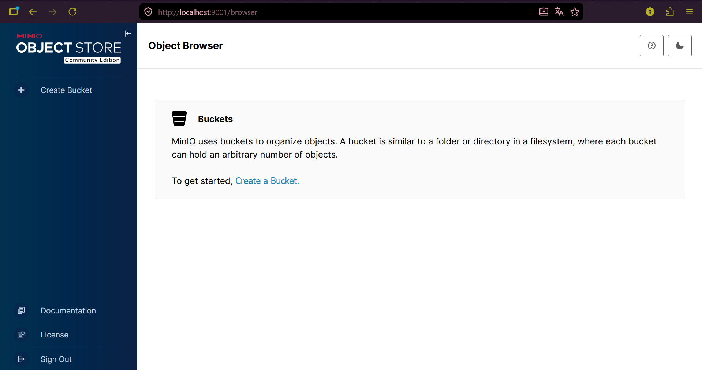
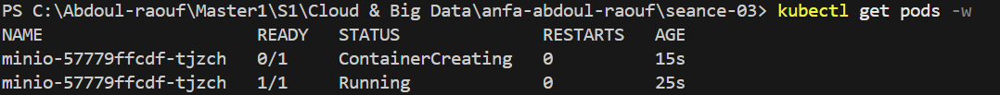
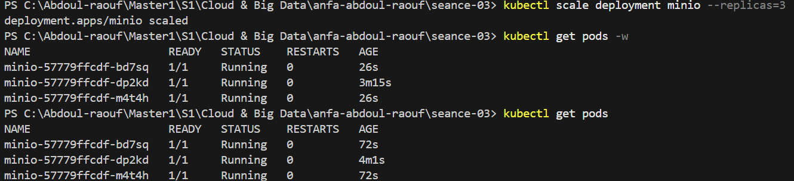

# Rendu Séance 3

**Nom et prénom :** SONHOUIN Abdoul-raouf

**Identifiant GitHub :** abdoul9001

**Date de soumission :** 25/06/2026

## Résumé de la séance
Installation de Kind et kubectl, création du cluster Kubernetes local anfa, configuration du namespace anfa. Déploiement de MinIO via 3 manifestes YAML (PersistentVolumeClaim, Deployment, Service). Observation concrète du self-healing après suppression manuelle d'un pod, puis scaling du Deployment de 1 à 3 replicas et retour à 1. Activation de l'Ingress Controller nginx en aperçu.
## Étapes principales
1. Installation de Kind et kubectl, création du cluster `anfa`.
2. Création du namespace `anfa` et configuration de kubectl.
3. Déploiement de MinIO via 3 manifestes YAML (PVC, Deployment, Service).
4. Observation du self-healing après suppression manuelle d'un pod.
5. Scaling du Deployment de 1 à 3 replicas, puis retour à 1.
6. Activation de l'Ingress Controller nginx.
## Captures d'écran
### Console MinIO accessible via port-forward

### Self-healing observé

### Scaling à 3 replicas

## Réponses aux exercices d'application

    ===========================
    Exercice 1 : QCM conceptuel
    ===========================

1.1 — Réponse : B
Kubernetes ne remplace pas Docker : il orchestre des conteneurs sur un cluster en s'appuyant sur un container runtime (containerd, Docker, CRI-O).

1.2 — Réponse : B
etcd est la base de données clé-valeur qui stocke l'état complet du cluster.

1.3 — Réponse : C
Le Scheduler décide sur quel nœud un nouveau pod doit être placé.

1.4 — Réponse : C
kubectl ne parle jamais directement aux pods, à etcd ou au Scheduler : il s'adresse à l'API Server, point d'entrée unique du cluster, qui se charge ensuite de consulter ou modifier l'état stocké dans etcd.

1.5 — Réponse : B
Le Deployment compare en permanence l'état observé à l'état souhaité (ici, 1 ou plusieurs replicas) ; en supprimant le pod il fait baisser le nombre de replicas observés, donc le Deployment recrée immédiatement un nouveau pod pour revenir à l'état souhaité.

1.6 — Réponse : B
Un Service de type NodePort ouvre un port fixe (30000-32767) sur chaque nœud du cluster, ce qui permet d'y accéder depuis l'extérieur sans dépendre d'un load balancer cloud (contrairement à LoadBalancer).

1.7 — Réponse : B
kubectl scale modifie l'état souhaité (le champ replicas du Deployment) ; Kubernetes converge ensuite vers ce nombre en créant ou supprimant des pods, sans toucher à la taille du cluster.

1.8 — Réponse : B
Le Namespace sert à isoler logiquement les ressources d'un cluster, par exemple par équipe, par environnement (dev/staging/prod) ou par application.

1.9 — Réponse : B
Avec Kind, chaque "nœud" Kubernetes est en réalité un conteneur Docker (basé sur l'image kindest/node), qui contient à la fois le Control Plane et le rôle de Worker.

    =====================================================
    Exercice 2 : Lecture et interprétation d'un manifeste
    =====================================================

2.1 — Rôle de selector.matchLabels et lien avec template.metadata.labels

selector.matchLabels indique au Deployment quels pods il doit gérer (surveiller, recréer, scaler) : tout pod portant le label app: anfa-api est considéré comme appartenant à ce Deployment. template.metadata.labels définit le label que les pods créés par CE Deployment recevront effectivement. Ces deux champs doivent correspondre : le Deployment ne "reconnaît" comme siens que les pods dont les labels matchent son sélecteur. C'est ce lien qui permet au Deployment de savoir, à tout instant, combien de pods "lui appartiennent" sont réellement en cours d'exécution, et donc de comparer cet état observé à l'état souhaité (replicas: 2).

2.2 — Nombre de pods créés et comportement en cas de mort d'un pod

Le Deployment va créer 2 pods (replicas: 2). Si l'un des deux meurt (crash, suppression manuelle, nœud qui tombe), le Controller Manager du Control Plane détecte que l'état observé (1 pod restant) ne correspond plus à l'état souhaité (2 replicas) et recrée immédiatement un nouveau pod pour revenir à 2 — c'est le mécanisme de self-healing.

2.3 — Pourquoi http://minio:9000 et pas une adresse IP

Dans Kubernetes, les pods sont éphémères et leur adresse IP change à chaque recréation : une IP en dur deviendrait rapidement invalide. minio est en réalité le nom d'un objet Service Kubernetes. Ce qui rend la résolution minio → adresse possible, c'est CoreDNS, le serveur DNS interne du cluster (visible dans le namespace kube-system) : il résout automatiquement le nom de chaque Service en l'adresse IP stable (ClusterIP) de ce Service, qui redirige ensuite le trafic vers les pods correspondants. C'est l'équivalent du DNS interne qu'on utilisait déjà avec les noms de services en Docker Compose.

2.4 — Conséquence de l'absence de Service

Sans Service, les pods de anfa-api n'ont pas d'adresse réseau stable : leur IP change à chaque redéploiement ou recréation, et aucun mécanisme de load balancing ne répartit le trafic entre les 2 replicas. En pratique, aucun autre composant du cluster ne peut atteindre l'API de façon fiable (et encore moins l'extérieur du cluster) : il manque le point d'entrée réseau stable que seul un objet Service fournit.

2.5 — Manifeste de Service (ClusterIP, port 80 → 8000)

    yaml# anfa-api-service.yaml
    apiVersion: v1
    kind: Service
    metadata:
    name: anfa-api
    namespace: anfa
    spec:
    type: ClusterIP        # par défaut : accessible uniquement à l'intérieur du cluster
    selector:
        app: anfa-api         # cible les pods créés par le Deployment anfa-api
    ports:
        - port: 80             # port exposé par le Service
        targetPort: 8000     # port du conteneur
.

    =======================
    Exercice 3 : Diagnostic
    =======================
3.1 — Le pod qui ne démarre pas

a. ImagePullBackOff signifie que Kubernetes n'arrive pas à télécharger (pull) l'image du conteneur depuis le registre, et qu'il réessaie périodiquement avec un délai croissant (backoff) entre chaque tentative.

b. La cause la plus probable ici est une faute de frappe dans le nom de l'image : minio/miniooo:latest au lieu de minio/minio:latest. Cette image n'existe pas sur Docker Hub, donc le pull échoue systématiquement.

c. kubectl describe pod minio-7d9f8b6c5-x2k9p permet d'obtenir le détail de l'erreur (section Events en bas de la sortie, qui affiche explicitement le message d'échec de pull).

3.2 — Le PVC qui ne se lie pas

a. Le statut Pending pour un PVC signifie que Kubernetes n'a pas encore trouvé (ou pas pu provisionner) de PersistentVolume capable de satisfaire la demande de stockage.

b. Dans le contexte d'un cluster Kind local, la cause la plus probable est que la capacité demandée (500 Gi) dépasse l'espace disque réellement disponible sur la machine hôte : le provisioner local de Kind (local-path-provisioner) crée les volumes directement sur le disque de la machine, qui n'a généralement pas 500 Go disponibles pour ça.

c. kubectl describe pvc data-pvc (section Events) pour voir le message d'erreur exact du provisioner, et éventuellement kubectl get storageclass pour vérifier qu'une StorageClass par défaut existe bien.

3.3 — Le port-forward qui échoue

a. Cette erreur apparaît parce que kubectl port-forward a besoin d'un pod en cours d'exécution (Running) pour rediriger du trafic vers lui ; ici le pod ciblé par le Service minio est encore en statut Pending, donc il n'existe pas de conteneur actif vers lequel rediriger les connexions.

b. kubectl describe pod **minio-57779ffcdf-tjzch** pour voir la section Events et comprendre pourquoi le pod reste en Pending (image en cours de téléchargement, ressources insuffisantes, PVC non lié, etc.).

c. L'ordre logique à respecter est : 
1) appliquer le PVC et vérifier qu'il est Bound, 
2) appliquer le Deployment et attendre que le pod soit Running (vérifiable avec kubectl get pods -w), 
3) appliquer le Service, et seulement ensuite 
4) lancer le port-forward.

.

    ===========================================
    Exercice 4 : De Docker Compose à Kubernetes
    ===========================================
4.1 — Nombre et rôle des manifestes Kubernetes nécessaires

Pour reproduire ce seul service Compose, il faut 3 manifestes distincts :

PersistentVolumeClaim : demande de stockage persistant, équivalent du volume nommé minio-data.
Deployment : décrit l'image à utiliser, la commande (server /data --console-address ":9001"), les variables d'environnement (MINIO_ROOT_USER, MINIO_ROOT_PASSWORD) et le cycle de vie du pod.
Service : expose le pod sur le réseau (équivalent du mapping ports: de Compose), avec un nom DNS stable utilisable par les autres pods du cluster.

4.2 — Différence conceptuelle entre un volume Docker nommé et un PVC

Un volume Docker nommé est une simple zone de stockage géré directement par le moteur Docker sur la machine locale : on le déclare et on l'utilise en une seule étape, sans notion d'allocation. Un PersistentVolumeClaim Kubernetes, lui, sépare la demande de stockage (le PVC, "je veux X Go avec tel mode d'accès") de la ressource physique réellement allouée (le PersistentVolume, qui peut être un disque local, un volume réseau ou un disque cloud comme un EBS AWS). Cette indirection permet à Kubernetes de fonctionner sur n'importe quel type d'infrastructure de stockage sans changer le manifeste applicatif, ce qu'un simple volume Docker local ne permet pas.

4.3 — Pourquoi le port-forward est nécessaire avec Kind, et comment l'éviter

En Docker Compose, le mapping ports: "9001:9001" relie directement un port de la machine hôte au conteneur, car Compose tourne sur une seule machine sans couche d'orchestration intermédiaire. Avec Kind, chaque "nœud" Kubernetes est lui-même un conteneur Docker isolé : le port NodePort (30901) est ouvert sur ce conteneur-nœud, mais pas automatiquement republié sur la machine hôte elle-même, d'où le besoin de kubectl port-forward pour créer ce pont supplémentaire. Pour accéder directement à MinIO sur un port de l'hôte comme avec Compose, il faudrait configurer Kind avec un fichier extraPortMappings au moment de la création du cluster (kind create cluster --config config.yaml), qui republie explicitement le NodePort choisi vers un port de la machine hôte.

4.4 — Deux apports concrets de Kubernetes observés en TP

Le self-healing : la suppression manuelle du pod MinIO (kubectl delete pod ...) a entraîné sa recréation automatique par le Deployment, sans aucune intervention supplémentaire — chose impossible nativement avec Docker Compose.
Le scaling déclaratif en une commande : kubectl scale deployment minio --replicas=3 a fait passer instantanément de 1 à 3 pods identiques (et inversement), alors qu'avec Compose le scaling est plus limité et ne bénéficie pas du même mécanisme de convergence automatique vers l'état souhaité.

    ===========================================
    Exercice 5 : Mini-cas d'architecture
    ===========================================
5.1 — Type d'objet Kubernetes le plus adapté pour chaque composant

Composant|Type d'objet|Justification
-|-|-
 pipeline-anfa|CronJob|Tâcheplanifiée qui doit se déclencher chaque nuit à 2h puis se terminer après ~15 minutes : c'est exactement le rôle d'un CronJob (planification récurrente d'un Job qui se termine).
 anfa-api|Deployment|Service stateless qui doit rester toujours disponible et dont le nombre de replicas varie selon la charge : c'est le cas d'usage typique du Deployment, combiné à un Service et un HPA.
 anfa-dashboard|Deployment|Grafana est une application stateless (sa configuration et ses données persistantes sont externalisées dans une base ou un volume séparé) consultée en journée par un nombre limité d'utilisateurs ; un Deployment à 1 ou 2 replicas avec disponibilité standard suffit, sans besoin de StatefulSet.

5.2 — Paramètres proposés pour l'HPA de anfa-api

- minReplicas: 2 — pour garantir une disponibilité minimale même en heures creuses (5 req/s) et permettre un load balancing de base.
- maxReplicas: 10 — pour absorber les pics à 50 req/s (heures de pointe matin/soir) avec une marge de sécurité.
- Métrique cible : utilisation CPU moyenne à 70 % (averageUtilization: 70).

Justification : le profil de charge décrit (5 req/s en creux, jusqu'à 50 req/s aux heures de pointe, soit un facteur ×10) correspond exactement au cas d'usage de l'HPA. En gardant un minimum de 2 replicas, l'API reste disponible même en cas de panne d'un pod sans attendre le scale-up. Le plafond de 10 replicas borne le coût et les ressources consommées tout en couvrant largement la charge de pointe observée.

5.3 — Type de Service pour anfa-api

ClusterIP, combiné à un Ingress pour l'exposition externe. anfa-api est consommée par des applications mobiles externes au cluster, donc un accès strictement interne (ClusterIP seul) ne suffirait pas ; mais plutôt que d'utiliser un LoadBalancer dédié (coûteux et peu pratique s'il y a d'autres services HTTP comme anfa-dashboard à exposer), on garde l'API en ClusterIP et on la rend accessible depuis l'extérieur via un Ingress Controller, qui route le trafic HTTP entrant vers le bon Service interne.

5.4 — Gestion par défaut des mises à jour par Kubernetes (rolling update)

Par défaut, un Deployment Kubernetes effectue un rolling update : lors d'une mise à jour de l'image, Kubernetes ne supprime pas tous les anciens pods d'un coup. Il démarre progressivement de nouveaux pods avec la nouvelle version, attend qu'ils soient prêts (Ready), puis supprime progressivement les anciens pods un par un (ou par petits lots), en respectant des paramètres comme maxUnavailable et maxSurge. À tout moment pendant la mise à jour, un nombre suffisant de pods (anciens ou nouveaux) reste disponible pour servir le trafic, ce qui évite toute coupure de service perceptible par les utilisateurs. En cas de problème, un rollback vers la version précédente est possible en une seule commande (kubectl rollout undo).

5.5 — Squelette de manifeste YAML pour anfa-api

    yamlapiVersion: apps/v1
    kind: Deployment
    metadata:
    name: anfa-api
    spec:
    replicas: 3
    selector:
        matchLabels:
        app: anfa-api
    template:
        metadata:
        labels:
            app: anfa-api
        spec:
        containers:
            - name: api
            image: anfa/api:v1
            ports:
                - name: http
                containerPort: 8000
            env:
                - name: MINIO_ENDPOINT
                value: "http://minio:9000"
## Difficultés rencontrées

Aucune 