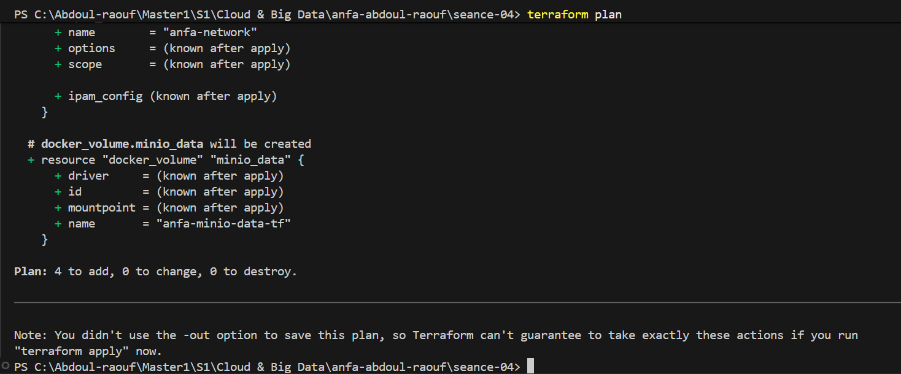
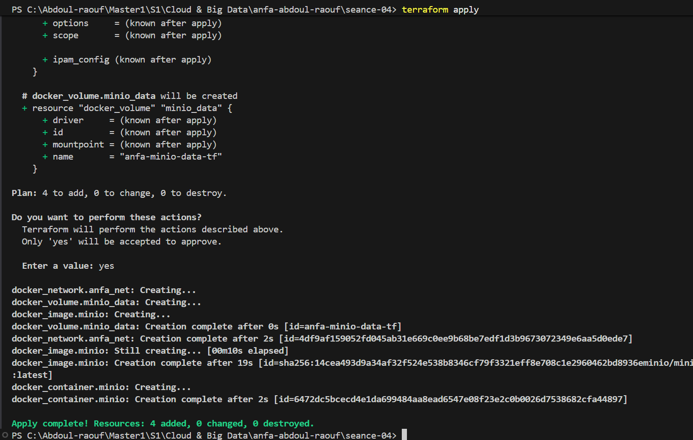
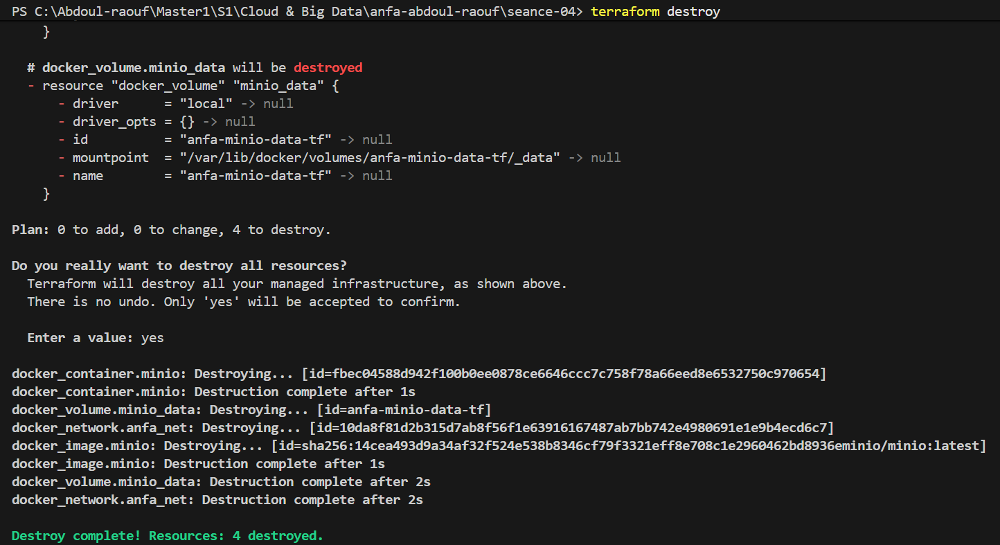

# Rendu — Séance 4
**Nom et prénom :** SONHOUIN Abdoul-raouf

**Identifiant GitHub :** abdoul9001

**Date de soumission :** 27/06/2026
## Résumé de la séance
Terraform a été installé et le workflow fondamental init → plan → apply → destroy a été maîtrisé. Une infrastructure Docker complète (réseau, volume, conteneur MinIO) a été décrite en HCL. Le rôle du fichier terraform.tfstate a été compris, ainsi que les raisons pour lesquelles il ne doit jamais être commité dans Git. Le code a été refactorisé à l'aide de variables.tf et d'un fichier terraform.tfvars pour le rendre propre, paramétrable et réutilisable.
## Étapes principales
1. Installation de Terraform et premier `main.tf` minimal.
2. Maîtrise du workflow `init` → `plan` → `apply` → `destroy`.
3. Compréhension du state Terraform et bonnes pratiques de versioning.
4. Stack complète : réseau, volume, conteneur MinIO.
5. Refactoring en variables et fichier `.tfvars`.
## Captures d'écran
### terraform plan (création initiale)

### terraform apply réussi

### Console MinIO créée par Terraform

### terraform destroy

## Réponses aux exercices d'application

===========================

Exercice 1 — QCM conceptuel

===========================

1.1 — Réponse : B

L'affirmation fausse est B : "L'IaC remplace totalement la nécessité de comprendre l'infrastructure sous-jacente." L'IaC automatise le provisioning, mais le praticien doit toujours comprendre ce qu'il décrit (réseaux, volumes, ports, dépendances). Les affirmations A, C et D sont toutes vraies selon les principes fondamentaux vus en cours.

1.2 — Réponse : B

Le déclaratif décrit l'état final souhaité ("je veux un conteneur avec ce volume") ; l'impératif décrit la séquence d'actions à exécuter ("crée un conteneur, puis monte ce volume"). Terraform est déclaratif : l'outil calcule lui-même les étapes pour atteindre l'état souhaité, et recalcule si quelque chose a dérivé.

1.3 — Réponse : B

Une opération idempotente produit le même résultat qu'elle soit exécutée une fois ou dix fois. Avec Terraform : si l'infrastructure est déjà conforme au code, un deuxième terraform apply ne fait rien ("No changes. Your infrastructure matches the configuration.").

1.4 — Réponse : B

Un provider est un plugin qui implémente la communication avec une API spécifique. Terraform n'a aucune connaissance native de Docker, AWS ou Kubernetes : il délègue toute interaction à ces plugins (kreuzwerker/docker, hashicorp/aws, etc.). Dans ce TP, on utilise le provider Docker.

1.5 — Réponse : B

Terraform compare le code (état souhaité) au fichier terraform.tfstate (état réel connu). S'il ne détecte aucun écart, il n'effectue aucune action. Il ne recrée pas, ne supprime pas, et n'échoue pas sur des resources existantes. C'est l'idempotence en action.

1.6 — Réponse : C

Le fichier terraform.tfstate mémorise ce que Terraform a créé : IDs, configurations, dépendances entre resources. C'est grâce à ce fichier qu'il peut suivre les changements incrémentaux et ne modifier que ce qui a changé, plutôt que tout reconstruire à chaque apply.

1.7 — Réponse : B

Le fichier terraform.tfstate peut contenir des secrets en clair (mots de passe, clés API présents dans les variables d'environnement des conteneurs). De plus, des commits concurrents de plusieurs membres de l'équipe peuvent le corrompre, rendant Terraform incapable de réconcilier l'état réel avec le code.

1.8 — Réponse : C

terraform plan génère un aperçu (plan d'exécution) de tous les changements que Terraform appliquerait (créations +, modifications ~, suppressions -), sans effectuer aucune action. C'est la règle d'or : toujours regarder le plan avant l'apply.

1.9 — Réponse : B

OpenTofu est un fork open source de Terraform créé par la Linux Foundation en réponse au changement de licence de HashiCorp en août 2023 (passage de MPL vers BSL). Il est 100 % compatible HCL avec Terraform et reste sous licence libre (Mozilla Public License).

1.10 — Réponse : B

Terraform et Ansible sont complémentaires, non concurrents. Terraform provisionne l'infrastructure (crée des VM, réseaux, volumes), tandis qu'Ansible configure des machines existantes (installe des paquets, modifie des fichiers de configuration). Le workflow typique en entreprise : Terraform crée les VM → Ansible les configure.

==============================================

Exercice 2 — Lecture et interprétation d'un fichier Terraform

==============================================

2.1 — Les 4 resources et leur rôle

ResourceRôledocker_network "back"Crée un réseau Docker isolé nommé anfa-backend, permettant aux conteneurs de communiquer entre eux sans exposer les ports à l'hôte.docker_volume "data"Crée un volume Docker nommé postgres-data pour persister les données PostgreSQL indépendamment du cycle de vie du conteneur.docker_image "postgres"Télécharge et référence l'image Docker postgres:15 depuis Docker Hub, et expose son ID réel (SHA256) via l'attribut image_id.docker_container "db"Crée le conteneur PostgreSQL (anfa-postgres) en assemblant les trois resources précédentes : image, ports exposés, volume monté, variables d'environnement et réseau.

2.2 — Référence docker_image.postgres.image_id

docker_image.postgres.image_id est une référence inter-resource : elle pointe vers l'attribut image_id de la resource docker_image nommée postgres.

Avantage par rapport à écrire image = "postgres:15" directement : un tag Docker comme postgres:15 est un tag dit "rolling" — il peut pointer vers des builds différents au fil du temps. En référençant image_id, on utilise le SHA256 exact de l'image telle qu'elle a été téléchargée par Terraform, garantissant une reproductibilité parfaite d'un environnement à l'autre. De plus, cela crée une dépendance implicite : Terraform sait qu'il doit créer docker_image.postgres avant docker_container.db.

2.3 — Ordre de création lors du premier apply

Terraform analyse les références entre resources pour construire un graphe de dépendances orienté acyclique (DAG). L'ordre sera :

docker_network.back, docker_volume.data et docker_image.postgres — ces trois resources n'ont aucune dépendance entre elles ; Terraform les crée en parallèle.
docker_container.db — créé en dernier, car il référence les trois resources précédentes (image_id, volume_name, name du réseau). Terraform attend que les trois soient disponibles avant de lancer la création du conteneur.

C'est la mécanique fondamentale de Terraform : les références implicites définissent l'ordre d'exécution sans que l'utilisateur n'ait à le spécifier manuellement.

2.4 — Problème de sécurité et correction

Le problème principal : le mot de passe PostgreSQL (POSTGRES_PASSWORD=secret123) est écrit en clair dans le code source. Si ce fichier est commité dans Git, le secret est exposé dans l'historique de façon définitive, même si on supprime le fichier ultérieurement.

Correction concrète : extraire le mot de passe dans une variable marquée sensitive.

hcl# variables.tf
variable "postgres_password" {
  type        = string
  description = "Mot de passe administrateur PostgreSQL"
  sensitive   = true  # Terraform masque cette valeur dans les logs
}

# Dans main.tf, remplacer la section env par :
    env = [
    "POSTGRES_DB=anfa",
    "POSTGRES_USER=anfa_user",
    "POSTGRES_PASSWORD=${var.postgres_password}",
    ]

# Créer un fichier terraform.tfvars (exclu de Git via .gitignore) :
    postgres_password = "secret123"

2.5 — Comportement après terraform destroy + modification du port + terraform apply

Après terraform destroy, le state est vide : Terraform ne connaît plus aucune resource. Lors du terraform apply suivant (avec external = 5433), Terraform considère que tout est à créer depuis zéro. Il crée donc les quatre resources comme lors d'une première installation, mais le conteneur PostgreSQL sera cette fois accessible sur le port hôte 5433 au lieu de 5432.

Note : si le destroy n'avait pas eu lieu et que seul le port avait été modifié, Terraform aurait détecté la modification et proposé de recréer le conteneur uniquement (les ports ne sont pas modifiables à chaud sur Docker), tout en conservant le réseau et le volume.

=============================

Exercice 3 — Diagnostic

=============================

3.1 — L'apply qui échoue avec une dépendance circulaire

a. Signification de l'erreur Error: Cycle: docker_container.a, docker_container.b

Une dépendance circulaire a été détectée dans le graphe de dépendances : docker_container.a dépend de docker_container.b (via son env), et docker_container.b dépend de docker_container.a. Le graphe forme une boucle.

b. Pourquoi Terraform refuse d'appliquer

Terraform construit un graphe orienté acyclique (DAG) pour déterminer l'ordre de création. Si deux resources se référencent mutuellement, il est impossible de déterminer laquelle créer en premier : pour créer A, il faut B ; pour créer B, il faut A. Le moteur ne peut pas résoudre cet ordre et rejette la configuration.

c. Solution proposée

Briser le cycle en supprimant la référence dans l'une des deux directions. L'un des conteneurs doit utiliser une valeur statique plutôt qu'une référence à l'autre resource :

    hclresource "docker_container" "a" {
    name  = "container-a"
    image = "alpine"
    # container-a peut toujours référencer container-b
    env   = ["LINKED_TO=${docker_container.b.name}"]
    }

    resource "docker_container" "b" {
    name  = "container-b"
    image = "alpine"
    # container-b utilise une valeur statique : plus de dépendance vers a
    env   = ["LINKED_TO=container-a"]
    }

3.2 — Le plan qui veut tout recréer (-/+)

a. Pourquoi -/+ au lieu de ~

Le symbole ~ signifie qu'une propriété peut être modifiée en place (in-place update) sans supprimer/recréer la resource. Le symbole -/+ (forces replacement) signifie qu'une propriété modifiée ne peut pas être changée sur un conteneur en cours d'exécution : Docker ne permet pas de modifier les variables d'environnement (env) d'un conteneur existant. La seule façon d'appliquer ce changement est de supprimer le conteneur et d'en créer un nouveau.

b. Les données du volume seront-elles perdues ?

Non. Le volume Docker (docker_volume) est une resource indépendante du conteneur. Seul le conteneur est recréé (-/+), pas le volume. Le nouveau conteneur remonte le même volume avec les mêmes données. C'est précisément l'intérêt de séparer les données (volume) de la logique d'exécution (conteneur).

c. Impact opérationnel en production

La recréation n'est pas gratuite. Elle implique un temps d'indisponibilité (downtime) : le conteneur est arrêté, supprimé, puis recréé. Selon l'application, cela peut signifier quelques secondes à quelques minutes d'interruption de service, des connexions en cours rompues, et des alertes déclenchées. En production, ces changements doivent être planifiés hors des heures de pointe, idéalement avec une stratégie de déploiement blue-green ou canary pour les services critiques.

3.3 — Le state corrompu (push accidentel sur GitHub)

a. Problème de sécurité immédiat

Le fichier terraform.tfstate contient les variables d'environnement des conteneurs, y compris les mots de passe en clair (MINIO_ROOT_PASSWORD, clés API…). En le poussant sur GitHub — même dans un dépôt privé — ces secrets sont exposés dans l'historique Git, accessible à tout collaborateur ayant accès au dépôt. Git conserve l'historique même après suppression du fichier ; il faut utiliser git filter-branch ou BFG Repo-Cleaner pour purger ces données de l'historique.

b. Risque technique quand Awa applique Terraform avec ce state récupéré

Terraform suppose que les resources décrites dans le state existent déjà sur le daemon Docker local d'Awa. Or elles n'existent pas (elles sont sur la machine de l'étudiant original). Terraform va tenter de gérer des resources qu'il n'a pas créées, provoquant des erreurs ou un état incohérent. Les deux personnes travaillent sur le même state en parallèle, ce qui peut mener à des conflits et à une corruption définitive du state.

c. Solution pérenne pour le travail en équipe

Mettre en place un remote backend pour stocker le state de façon centralisée et sécurisée :

    hcl# Exemple de configuration remote backend S3
    terraform {
    backend "s3" {
        bucket         = "anfa-terraform-state"
        key            = "seance04/terraform.tfstate"
        region         = "eu-west-1"
        # DynamoDB pour le state locking (empêche deux apply simultanés)
        dynamodb_table = "terraform-state-lock"
        encrypt        = true
    }
    }

Cela garantit : un seul state partagé entre tous les membres, un mécanisme de verrouillage (state lock), le chiffrement des secrets au repos, et aucun secret dans Git.

==================================================

Exercice 4 — Adaptation Docker Compose → Terraform

==================================================

Traduction du docker-compose.yml de la séance 2 (services MinIO + Jupyter) en HCL Terraform. Le mot de passe MinIO est extrait dans une variable sensitive. Un réseau Docker partagé remplace le réseau implicite de Compose. Les dépendances sont gérées automatiquement par les références inter-resources (pas besoin de depends_on explicite).

variables.tf

    hcl# variables.tf — Paramètres configurables de la stack Anfa

    # Mot de passe administrateur MinIO — sensible, ne jamais écrire en clair dans main.tf
    variable "minio_root_password" {
    type        = string
    description = "Mot de passe du compte root MinIO"
    sensitive   = true
    }

    # Utilisateur administrateur MinIO
    variable "minio_root_user" {
    type        = string
    description = "Nom du compte root MinIO"
    default     = "anfa-admin"
    }

    # Token d'accès Jupyter
    variable "jupyter_token" {
    type        = string
    description = "Token d'authentification Jupyter"
    sensitive   = true
    default     = "anfa-token"
    }

    main.tf

    hcl# main.tf — Stack Anfa : MinIO + Jupyter (équivalent Compose séance 2)

    # ── Déclaration du provider Docker ──────────────────────────────────────────
    terraform {
    required_providers {
        docker = {
        source  = "kreuzwerker/docker"
        version = "~> 3.0"
        }
    }
    }

    provider "docker" {}

    # ── Réseau partagé entre les deux services ───────────────────────────────────
    # Équivalent du réseau implicite créé automatiquement par docker-compose
    resource "docker_network" "anfa_net" {
    name = "anfa-network"
    }

    # ── Volume persistant pour les données MinIO ─────────────────────────────────
    # Équivalent du volume nommé "minio-data" dans le docker-compose.yml
    resource "docker_volume" "minio_data" {
    name = "anfa-minio-data"
    }

    # ── Image MinIO ──────────────────────────────────────────────────────────────
    # Terraform télécharge l'image et expose son SHA256 via image_id
    resource "docker_image" "minio" {
    name = "minio/minio:latest"
    }

    # ── Image Jupyter ────────────────────────────────────────────────────────────
    resource "docker_image" "jupyter" {
    name = "jupyter/scipy-notebook:latest"
    }

    # ── Conteneur MinIO ──────────────────────────────────────────────────────────
    resource "docker_container" "minio" {
    name    = "anfa-minio"
    # On référence image_id (SHA256 réel) plutôt que le tag, pour la reproductibilité
    image   = docker_image.minio.image_id
    restart = "unless-stopped"

    # Commande de démarrage du serveur MinIO avec console sur :9001
    command = ["server", "/data", "--console-address", ":9001"]

    # Port API MinIO
    ports {
        internal = 9000
        external = 9000
    }

    # Port console web MinIO
    ports {
        internal = 9001
        external = 9001
    }

    # Variables d'environnement — mot de passe injecté via variable sensitive
    env = [
        "MINIO_ROOT_USER=${var.minio_root_user}",
        "MINIO_ROOT_PASSWORD=${var.minio_root_password}",
    ]

    # Montage du volume de données
    volumes {
        volume_name    = docker_volume.minio_data.name
        container_path = "/data"
    }

    # Connexion au réseau partagé
    networks_advanced {
        name = docker_network.anfa_net.name
    }

    # Évite la recréation à chaque plan due aux log_opts injectés par le moteur Docker
    lifecycle {
        ignore_changes = [log_opts]
    }
    }

    # ── Conteneur Jupyter ────────────────────────────────────────────────────────
    # Terraform gère la dépendance envers le réseau automatiquement :
    # docker_network.anfa_net sera créé avant ce conteneur grâce à la référence ci-dessous.
    # Pas besoin de depends_on explicite comme dans docker-compose.
    resource "docker_container" "jupyter" {
    name    = "anfa-jupyter"
    image   = docker_image.jupyter.image_id
    restart = "unless-stopped"

    ports {
        internal = 8888
        external = 8888
    }

    # Token d'authentification Jupyter
    env = [
        "JUPYTER_TOKEN=${var.jupyter_token}",
    ]

    # Connexion au même réseau que MinIO — crée la dépendance implicite
    networks_advanced {
        name = docker_network.anfa_net.name
    }

    lifecycle {
        ignore_changes = [log_opts]
    }
    }

    # ── Outputs exposés après apply ──────────────────────────────────────────────
    output "minio_console_url" {
    description = "URL de la console web MinIO"
    value       = "http://localhost:9001"
    }

    output "jupyter_url" {
    description = "URL de Jupyter Notebook"
    value       = "http://localhost:8888"
    }

    terraform.tfvars.example

    hcl# terraform.tfvars.example — Modèle à copier en terraform.tfvars
    # Ce fichier EST versionné dans Git (il ne contient pas de vraies valeurs)
    # Le vrai terraform.tfvars est exclu par .gitignore

    minio_root_password = "votre-mot-de-passe-ici"
    jupyter_token       = "votre-token-ici"
    # minio_root_user est optionnel (valeur par défaut : "anfa-admin")

======================================

Exercice 5 — Mini-cas d'architecture Anfa sur OVHcloud

=======================================

5.1 — Types de resources Terraform prévues

Type de resourceJustificationBucket de stockage objet (Object Storage)Stocker les CSV du référentiel et les futurs logs GPS côté OVHcloud, conformément à l'exigence de souveraineté des données.Cluster Kubernetes managéDéployer les traitements Spark de façon élastique : scale up aux heures de pointe, scale down sinon.Réseau privé virtuel (Private Network / vRack)Isoler les communications internes (Spark, MinIO, BDD) sans les exposer sur Internet.Instance de compute (VM ou instance cloud)Héberger le dashboard Grafana avec une IP publique et un certificat TLS.Enregistrement DNS publicExposer Grafana sous un nom de domaine lisible accessible depuis n'importe quel téléphone.Groupe de sécurité / firewallContrôler les flux : seul le port 443 (HTTPS) de Grafana est public ; les autres composants restent privés.

5.2 — Un seul main.tf vs plusieurs fichiers .tf

Recommandation : l'approche B (plusieurs fichiers séparés).

Terraform lit tous les fichiers .tf du répertoire de travail comme un seul ensemble, donc la séparation est purement organisationnelle — mais elle est cruciale. Un fichier unique de 800 lignes est difficile à lire, à réviser en code review, et à maintenir en équipe : un conflit Git sur main.tf bloque tout le monde. Avec network.tf, storage.tf, compute.tf, monitoring.tf, chaque membre peut travailler sur son périmètre indépendamment, les diffs sont lisibles, et on localise immédiatement ce qu'on cherche.

5.3 — Gérer deux environnements (dev / prod)

Terraform propose deux mécanismes principaux :

Fichiers .tfvars par environnement : créer terraform.dev.tfvars et terraform.prod.tfvars avec des valeurs différentes (taille de cluster, mots de passe, noms de buckets). Appliquer avec terraform apply -var-file=terraform.prod.tfvars. Le code HCL reste unique et paramétré via des variables.
Workspaces Terraform (terraform workspace new dev / terraform workspace new prod) : Terraform maintient un state séparé par workspace, permettant de gérer dev et prod depuis le même répertoire avec la même configuration. Chaque workspace a son propre terraform.tfstate isolé.

5.4 — Migration OVHcloud → AWS : triviale ou non ?

La migration ne sera pas triviale, mais Terraform en réduit considérablement l'effort par rapport à une configuration manuelle.

Ce qui se transpose facilement :

La logique d'infrastructure (réseaux privés, clusters, stockage objet, DNS) reste identique conceptuellement d'un fournisseur à l'autre.
Les fichiers variables.tf, outputs.tf, et l'organisation en fichiers séparés restent valides sans modification.
Les patterns HCL (variables, outputs, références inter-resources, modules) sont réutilisables à 100 % quel que soit le provider.

Ce qui demandera du travail :

Chaque resource devra être réécrite avec le provider AWS (aws_s3_bucket au lieu du bucket OVH, aws_eks_cluster au lieu du Kubernetes managé OVH, etc.). C'est un remplacement de provider, pas une migration automatique.
Les noms de ressources, les régions, les options spécifiques à AWS (IAM, politiques de sécurité, VPC) sont différents et doivent être adaptés.
Un terraform destroy sur OVH suivi d'un terraform apply sur AWS implique une interruption de service si aucune stratégie de migration parallèle (blue-green) n'est prévue.

Estimation réaliste pour une infrastructure de cette taille : 2 à 5 jours de travail pour réécrire les fichiers .tf, tester en dev, valider en prod. Sans IaC, la même migration prendrait plusieurs semaines de configuration manuelle.

5.5 — 3 bonnes pratiques pour une équipe de 4 personnes

Remote backend dès le départ : configurer un backend distant (Terraform Cloud ou S3 + DynamoDB) avant même la première vraie apply en équipe. Cela évite les conflits de state, protège les secrets, garantit que tout le monde travaille sur le même état de l'infrastructure, et active le state locking (deux apply simultanés sont impossibles).
Workflow GitOps avec revue obligatoire : toute modification de .tf passe par une Pull Request. Le pipeline CI lance automatiquement terraform plan et poste le résultat en commentaire de la PR. L'apply en production ne se déclenche qu'après approbation d'au moins un pair. Personne n'applique Terraform depuis sa machine locale en production.
.gitignore strict et fichier .example pour les secrets : le .gitignore exclut *.tfstate, *.tfvars, et .terraform/. Pour chaque fichier .tfvars sensible, un fichier .tfvars.example versionné documente les variables attendues sans exposer les valeurs réelles. Les vrais secrets sont injectés par le CI/CD (via Vault ou AWS Secrets Manager), jamais stockés dans le dépôt.

## Difficultés rencontrées
Aucune 